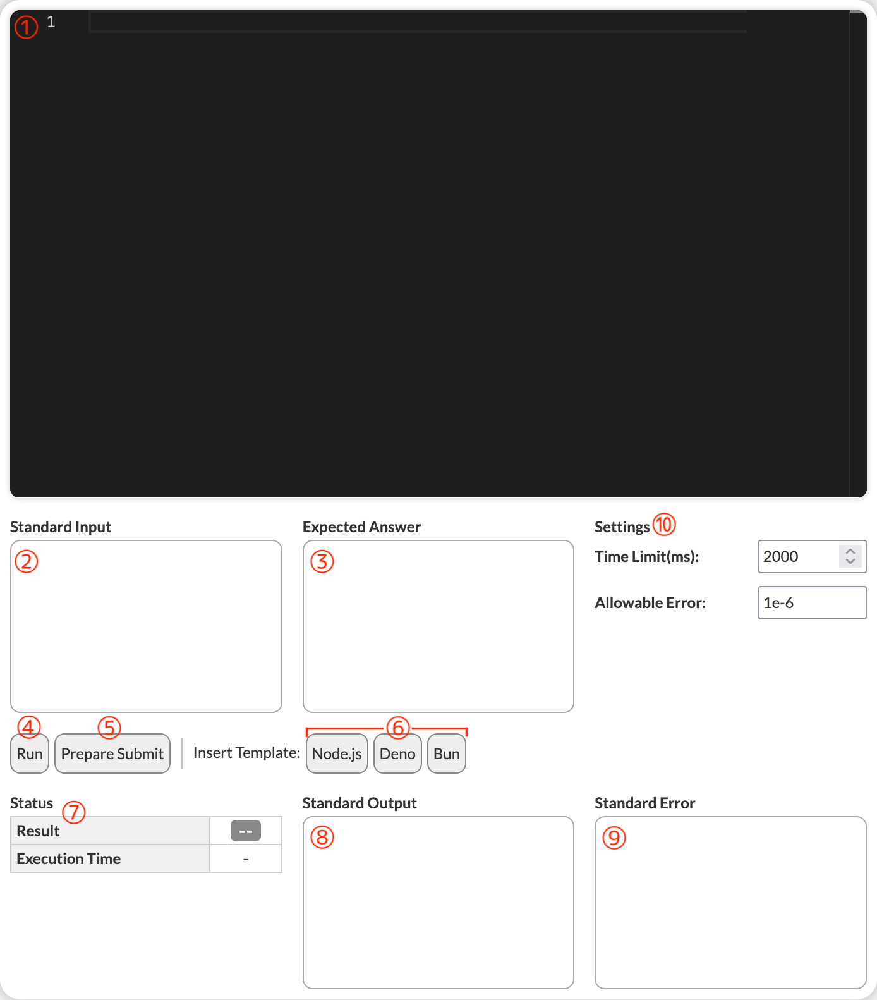

# AtCoder-JavaScript-Tester

AtCoderの問題ページで、JavaScriptのコードを編集・テスト実行・提出準備を行えるようにするユーザースクリプトです。

## ライセンス

copyright (c) 2025- Ayasaka-Koto
This project is licensed under [the MIT License](https://opensource.org/licenses/MIT).

## 特徴

1. 外部環境に依存しない、ブラウザ完結のコードテスト
    - JavaScriptコードを直接ブラウザ上(Web Worker)で実行するため、AtCoderのコードテストなどの外部環境に依存しません。
2. Monaco Editorによる高度なコード編集機能
    - Visual Studio Codeで使用されているMonaco Editorを組み込んでおり、Syntax HighlightやIntelliSenseなどの高度なコード編集機能が利用できます。
3. クリップボードへのコードコピーと提出準備
    - 編集したコードを問題ページ下部のソースコード入力欄に自動入力することができます。

## インストール方法

1. [Tampermonkey](https://www.tampermonkey.net/)などのユーザースクリプトマネージャーをブラウザにインストールします。
2. [このリンク](https://cdn.jsdelivr.net/gh/AXT-AyaKoto/AtCoder-JavaScript-Tester/@main/index.user.js)からユーザースクリプトをインストールします。

## 使い方

AtCoderの問題ページにアクセスすると、問題文が画面左に寄り、右側にコードエディタとテスト実行用のUIが追加されます。

1. コードエディター
    - コードを編集できます。Syntax HighlightやIntelliSenseなどが利用可能です。
2. Standard Input (textarea)
    - コードに渡す標準入力をここに入力します。「入力例」をコピペするなどして利用してください。
3. Expected Output (textarea)
    - コードの実行結果と比較する期待される出力をここに入力します。「出力例」をコピペするなどして利用してください。
4. Run Test ボタン
    - 入力された標準入力を使ってコードを実行し、出力結果を期待される出力と比較します。
    - 結果は画面下部に表示されます。
5. Prepare Submit ボタン
    - 編集したコードをクリップボードにコピーします。
    - また、ページ下部のソースコード入力欄までスクロールし、コードを自動でセットします。
6. Insert Template ボタン
    - Node.js, Deno, Bunの各ランタイム向けのコードテンプレートを挿入します。
    - このコードテンプレートを大きく逸脱したコードを書くと、テスト実行が正しく動作しない可能性があります。
7. 実行結果表示エリア
    - Result: AtCoderに近い形で結果を表示します。(`AC`, `WA`, `TLE`など)
    - Execution Time: コードの実行時間をミリ秒単位で表示します。
8. Standard Output (textarea readonly)
    - コードの実行結果がここに表示されます。
9. Standard Error (textarea readonly)
    - コードの実行中に発生したエラーがここに表示されます。
10. Settings
    - Time Limit (ms): コードの実行時間制限をミリ秒単位で設定します。
        - 問題文に記載されている制限時間を自動反映する仕組みになっていますが、必要に応じて手動で変更できます。
    - Allowable Error: 浮動小数点数出力の許容誤差を設定します。
        - 浮動小数点数を出力する問題の場合、ここで設定した誤差範囲内であれば正解とみなされます。
        - 浮動小数点数を出力しない問題の場合などではそのままで問題ありません。
